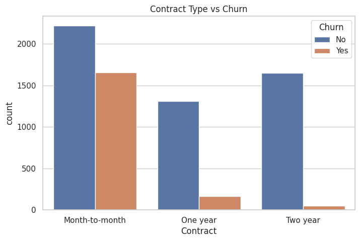

# Customer-Churn-Analysis-EDA
Customer Churn Analysis using Python, Pandas, Matplotlib, and Seaborn. Performed data cleaning, exploratory data analysis (EDA), and visualization to uncover customer churn patterns and generate actionable business insights.

# 📊 Customer Churn Analysis using Exploratory Data Analysis (EDA)

## 📌 Project Overview

Customer churn is one of the biggest challenges faced by subscription-based businesses. This project performs **Exploratory Data Analysis (EDA)** on the IBM Telco Customer Churn dataset to identify the key factors that influence customer churn and provide actionable business insights for improving customer retention.

The project includes data cleaning, preprocessing, visualization, and insight generation using Python.

---

## 🎯 Objectives

* Clean and preprocess customer data.
* Explore customer demographics and service usage.
* Analyze factors affecting customer churn.
* Visualize trends using charts and graphs.
* Generate business recommendations to improve customer retention.

---

## 🛠️ Technologies Used

* Python
* Google Colab
* Pandas
* NumPy
* Matplotlib
* Seaborn

---

## 📂 Dataset

**IBM Telco Customer Churn Dataset**

The dataset contains customer demographic information, subscribed services, billing details, and churn status.

**Features include:**

* Customer Demographics
* Contract Type
* Internet Service
* Payment Method
* Monthly Charges
* Total Charges
* Tenure
* Churn Status

---

## 📊 Exploratory Data Analysis

The project includes:

* Data Cleaning
* Missing Value Handling
* Duplicate Value Check
* Data Type Conversion
* Statistical Summary
* Customer Churn Distribution
* Gender-wise Churn Analysis
* Senior Citizen Analysis
* Contract Type Analysis
* Internet Service Analysis
* Payment Method Analysis
* Monthly Charges Distribution
* Tenure Distribution
* Correlation Heatmap
* Business Insights

---

## 📸 Project Screenshots

### Customer Churn Distribution


### Contract Type vs Customer Churn



### Payment Method Analysis


### Monthly Charges Distribution


### Correlation Heatmap


---

## 💡 Key Insights

* Customers with **Month-to-Month contracts** have the highest churn rate.
* Customers with **Fiber Optic Internet Service** tend to churn more frequently.
* **Electronic Check** users show the highest customer churn.
* Customers with **higher monthly charges** are more likely to leave.
* Customers with **shorter tenure** exhibit higher churn rates.
* Long-term contracts significantly improve customer retention.

---

## 📈 Business Recommendations

* Encourage customers to switch to long-term contracts through discounts and incentives.
* Improve customer support and service quality for Fiber Optic users.
* Offer personalized retention campaigns for high-risk customers.
* Provide loyalty rewards for long-term customers.
* Reduce early-stage churn with onboarding offers for new customers.

---

## 📁 Repository Structure

```text
Customer-Churn-Analysis-EDA/
│
├── Customer_Churn_Analysis.ipynb
├── README.md
├── requirements.txt
├── LICENSE
├── .gitignore
├── images/
│   ├── churn_distribution.png
│   ├── contract_vs_churn.png
│   ├── payment_method_vs_churn.png
│   ├── monthly_charges_distribution.png
│   └── correlation_heatmap.png
└── dataset/
```

---

## ▶️ Getting Started

1. Clone the repository:

```bash
git clone https://github.com/your-username/Customer-Churn-Analysis-EDA.git
```

2. Navigate to the project directory:

```bash
cd Customer-Churn-Analysis-EDA
```

3. Install the required libraries:

```bash
pip install -r requirements.txt
```

4. Open the Jupyter Notebook or Google Colab notebook and run all cells.

---

## 📌 Future Improvements

* Build a machine learning model to predict customer churn.
* Create an interactive dashboard using Power BI or Tableau.
* Develop a Streamlit web application for churn prediction.
* Perform feature engineering and model comparison.

---

## 👨‍💻 Author
Bhumi Jain
If you found this project useful, consider giving it a ⭐ on GitHub.

